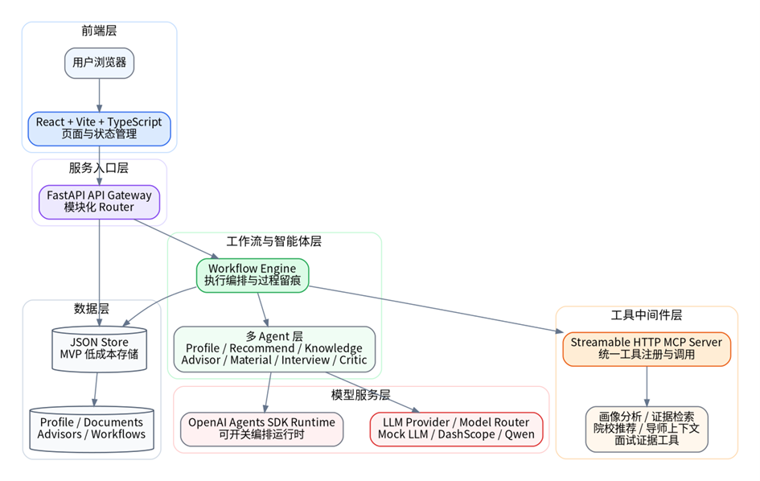
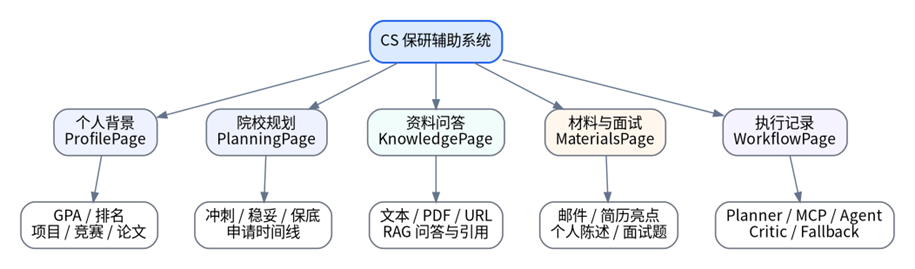

# Baoyan Agent

面向 CS 保研场景的多 Agent 中间件原型。系统把用户画像、院校规划、知识检索、导师匹配、申请材料和模拟面试组织成可执行、可追踪的工作流，而不是为每个按钮简单封装一次大模型请求。

## 项目亮点

- **真实 MCP 互操作**：FastAPI 业务服务通过 Streamable HTTP 调用独立 MCP Server，15 个结构化工具覆盖画像、规划、知识库、导师和面试证据。
- **统一多 Agent 底座**：A、B、C 三个模块共享 OpenAI Agents SDK 的 `Agent + Runner + Context + Tool` 执行方式。
- **受约束动态工作流**：C 模块实现 `Planner -> MCP Tool -> Generate -> Critic -> Revise`，计划经过 Pydantic 与能力注册表校验，最多重写一次。
- **稳定且可解释**：支持 DashScope 与 Mock/本地降级，工作流记录展示计划来源、工具参数与结果摘要、模型路由、耗时和 Critic 决策。

这些能力对应了课程关注的 MCP、MAS、规划智能体、Workflow-Task-Capability-Tool、模型路由和反馈闭环，并落实在可运行的保研业务流程中。

## 系统架构

### 技术架构



### 功能结构



浏览器只访问 FastAPI，MCP 调用发生在两个独立后端进程之间。文档、导师和工作流记录保存为本地 JSON，便于课程演示和复现。

## 快速开始

准备 Python、Node.js、npm 和 PowerShell，然后执行：

```powershell
git clone https://github.com/WahaD1123/baoyan-agent.git
cd baoyan-agent

cd backend
python -m venv .venv
.\.venv\Scripts\Activate.ps1
python -m pip install -r requirements.txt

cd ..\frontend
npm install
cd ..

Copy-Item .env.example .env
```

### 配置模型

默认 `.env` 使用 `LLM_PROVIDER=mock`，无需 API Key，可预览界面和内置降级结果。

完整演示 Agent SDK、真实模型路由和 MCP 工作流时，在本地 `.env` 中设置：

```dotenv
LLM_PROVIDER=dashscope
DASHSCOPE_API_KEY=your-local-api-key
LLM_BASE_URL=https://dashscope.aliyuncs.com/compatible-mode/v1
LLM_MODEL=qwen3.7-plus
AGENT_SDK_ENABLED=true
AGENT_SDK_MODEL=qwen3.7-plus

LLM_PLANNER_MODEL=qwen3.6-flash
LLM_CRITIC_MODEL=qwen3.6-flash
LLM_MEMBER_C_MODEL=qwen3.6-flash
```

不要提交 `.env` 或在代码、文档和日志中保存真实密钥。

### 启动服务

打开三个 PowerShell 终端。

终端 1，启动 FastAPI：

```powershell
cd backend
.\.venv\Scripts\Activate.ps1
uvicorn app.main:app --reload --port 8000
```

终端 2，启动 MCP Server：

```powershell
cd backend
.\.venv\Scripts\Activate.ps1
python -m app.mcp_server
```

终端 3，启动前端：

```powershell
cd frontend
npm run dev
```

访问 `http://localhost:5173`。MCP 服务地址为 `http://127.0.0.1:8002/mcp`。

## 功能模块

| 模块 | 主要能力 | 代表输出 |
|---|---|---|
| A：画像与院校规划 | 画像分析、证据检索、冲稳保推荐、时间线 | 竞争力分析、院校梯度、规划摘要 |
| B：知识库与导师匹配 | 文本/URL/PDF 入库、检索问答、导师主页解析与匹配 | 引用片段、匹配理由、联系建议 |
| C：材料与模拟面试 | 受约束规划、材料生成、Critic 审查、条件重写 | 导师邮件、简历亮点、个人陈述、面试题 |
| Workflow | 统一记录 Planner、Tool、Agent 与 Condition 步骤 | MCP 传输、模型、耗时、状态和降级原因 |

## 推荐演示流程

1. 查看或修改学生画像。
2. 导入招生通知、经验帖或导师主页，并执行知识问答。
3. 生成冲刺、稳妥、保底院校规划。
4. 完成导师匹配并生成导师联系邮件。
5. 生成简历亮点、个人陈述和模拟面试题。
6. 打开“执行记录”，展示 Planner、MCP、Agent、Critic 和模型路由链路。

## 测试

后端：

```powershell
cd backend
.\.venv\Scripts\Activate.ps1
$env:PYTEST_DISABLE_PLUGIN_AUTOLOAD='1'
python -m pytest
```

前端：

```powershell
cd frontend
npm run build
```

## 项目文档

- API：`docs/API.md`
- 架构：`docs/ARCHITECTURE.md`
- 团队分工：`docs/TEAM_GUIDE.md`
